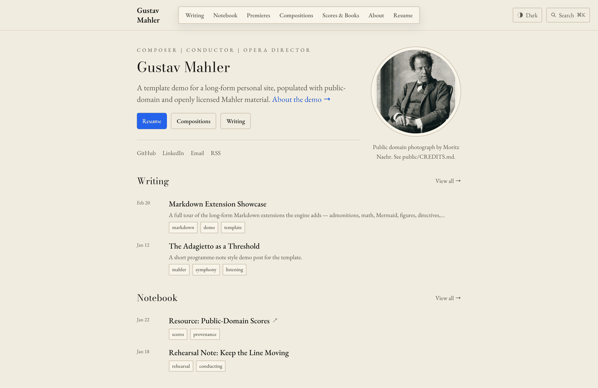
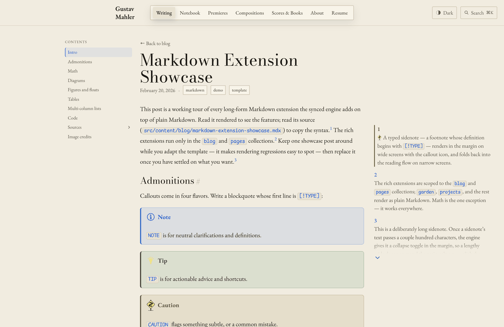
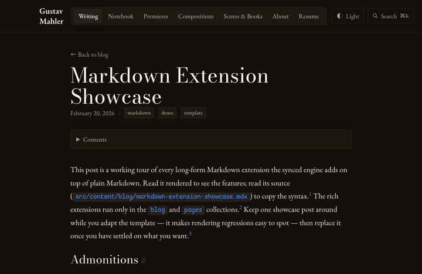
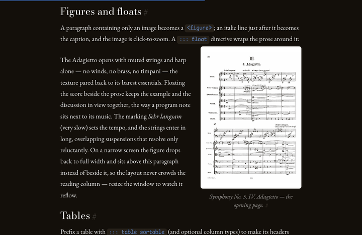

# andante-comodo

An Astro template for a personal portfolio, long-form writing, scores, recordings, RSS feeds, and a resume page.

This repository is intentionally populated with a Gustav Mahler demo identity. Replace the demo person, prose, media, links, and resume before publishing.

## Preview

The home page pairs a config-driven hero with your latest writing. Light and dark are a one-click toggle, persisted per visitor:



Blog and page collections render an extended long-form Markdown pipeline — admonitions, KaTeX math, Mermaid diagrams, click-to-zoom figures with float wrapping, sortable tables, multi-column lists, and sidenotes — themed the same way:



The full pipeline in motion, scrolling through one post:



Figures and diagrams are click-to-zoom, carrying their caption and credit into a full-screen lightbox:



## Quick Start

```bash
npm install
npm run dev          # local dev server at http://localhost:4321
```

To produce the production build and run the smoke checks:

```bash
npm run build
npm test             # node --test tests/smoke.mjs
```

## Getting Started

New to this kind of project? Here is the whole path from zero to a site running
on your machine.

1. **Get the code.** Click **Use this template** on GitHub to make your own copy,
   then clone it — or clone this repo directly.
2. **Install Node.** You need Node 20.3 or newer. If you do not have it, install
   it from [nodejs.org](https://nodejs.org/) (the LTS build is fine).
3. **Install dependencies:** `npm install`.
4. **Run it locally:** `npm run dev`, then open <http://localhost:4321>.
5. **Look around.** What you see is the demo persona ("Mahler"). Every section
   you see — the home page, About, and the writing/projects/reading collections
   — is demo content you will replace. Nav labels are configurable; the next
   section lists exactly which files to edit first.

When you are ready to make it yours, follow **First Files To Edit** and the
**Re-skinning** walkthrough below; both link to the deeper reference guides.

## First Files To Edit

- `src/config/site.mjs`: site name, email, origin, metadata, hero copy, portrait path, CTAs, social links, and feed copy.
- `src/config/collections.mjs`: collection labels, descriptions, navigation, homepage placement, feed inclusion, and taxonomy labels.
- `src/data/resume.ts`: all resume sections rendered at `/resume`.
- `src/content/`: posts, notes, projects, works, reading entries, and pages. To add a blog post, create a `.md` or `.mdx` file under `src/content/blog/` — the URL slug comes from the filename. While drafting, set `draft: true` to keep a post out of every listing and both feeds; remove it (or set `draft: false`) to publish.
- `public/`: portrait, Open Graph image, favicon, audio, score files, and any other static media.

Keep `src/config/site.mjs` and `src/config/collections.mjs` key names stable. The template's pages and feeds read those keys directly.

One heads-up: the footer shows a small "Like this website? Get the template."
line linking back to this repo, driven by `site.meta.templateHref`. Keeping it
is a nice way to credit the template, but it is entirely optional — delete that
key and the line disappears.

### Re-skinning: making it yours

The checklist above is the *what*; here is the *order* and where the details
live — link out, do not guess:

1. **Identity & config first.** Set your name, URLs, social links, and nav in
   `src/config/site.mjs`, your collections in
   `src/config/collections.mjs`, and your resume in `src/data/resume.ts`. The
   full field-by-field reference — including the re-skin checklist — is
   [`docs/template-config.md`](./docs/template-config.md).
2. **Look & feel next.** Type scale, palette, and fonts are a documented control
   surface; change them via the tokens described in
   [`docs/theming.md`](./docs/theming.md) (read it before editing
   `tailwind.config.mjs` or the CSS).
3. **Your content & media.** Replace `src/content/**` and the demo assets under
   `public/` (see **Demo Media Licensing** below before keeping any demo media).

Everything in step 1 and step 2 is documented in the reference guides —
this README is the front door; those guides are the manual.

## Build Requirements

Use Node 20.3 or newer.

```bash
npm install
npm run build
```

The Cloudflare adapter builds static output into `dist/`. The repository does not require secrets to build.

## Deploying

This site builds to static output for **Cloudflare** (the adapter is already
configured; `wrangler.jsonc` and `.env.example` are in the repo root).

1. Build: `npm run build` (output in `dist/`). The static site needs **no
   secrets** to build or deploy.
2. Deploy with the Cloudflare CLI — `npx wrangler deploy` — or connect the repo
   in the [Cloudflare Pages](https://developers.cloudflare.com/pages/get-started/git-integration/)
   dashboard ("Connect to Git").
3. Only if you enable the newsletter: set the `.env.example` keys (listmonk /
   reCAPTCHA) as deployment secrets.

For the full deploy and operations reference — exact Cloudflare/`wrangler`
steps, environment variables, and secrets — see
[**Deploy to Cloudflare** in `docs/template-config.md`](./docs/template-config.md#deploy-to-cloudflare).

## Demo Media Licensing

All demo media provenance is listed in `public/CREDITS.md`.

The Mahler 9 demo recording is CC BY-NC-ND 3.0 — replace it before commercial use
or any modified redistribution. The Mahler 2 demo recording is CC BY-SA 3.0 and
carries attribution/share-alike obligations if retained. The Mahler 5 Adagietto
recording and all demo scores are CC0 / public-domain.

For a real site, replace the demo media with your own and update
`public/CREDITS.md` and `NOTICE`.

## RSS And Newsletter Automation

The template includes RSS routes and an optional Listmonk sync workflow. If you do not use Listmonk, delete or disable `.github/workflows/rss-to-listmonk.yml`. If you keep it, configure the required Listmonk secrets before pushing blog changes to `main`.

## Further Reading

The deeper guides live in `docs/`:

- [`docs/template-config.md`](./docs/template-config.md) — identity, config,
  collections, resume, about, environment, and the re-skin checklist.
- [`docs/theming.md`](./docs/theming.md) — the type scale, palette, and font
  control surface.
- [`docs/content-features.md`](./docs/content-features.md) — rich long-form
  authoring: figures, math, diagrams, sortable tables, and sidenotes.
- [`docs/README.md`](./docs/README.md) — content types and frontmatter schemas
  for every collection.
- [`docs/admonition-schema.md`](./docs/admonition-schema.md) — admonition / aside
  authoring syntax for long-form posts.
- [`docs/listmonk-rss-automation.md`](./docs/listmonk-rss-automation.md) — the
  RSS -> listmonk newsletter automation.

## Contributing & Security

This is a "Use this template" starter — fork it and make it yours. If you want to
improve the template itself, see [`CONTRIBUTING.md`](./CONTRIBUTING.md); to report
a security issue, see [`SECURITY.md`](./SECURITY.md).

## License

The template **code** is MIT-licensed — see [`LICENSE`](./LICENSE). Use, modify,
and redistribute it freely.

The bundled demo **media** is **not** MIT: each Mahler score/recording carries its
own license (public domain / CC0 / CC BY-SA / CC BY-NC-ND), documented per file in
[`public/CREDITS.md`](./public/CREDITS.md) and `NOTICE`. Replace the demo media
with your own — in particular, the CC BY-NC-ND recording must be replaced for any
commercial or modified use.

The footer's "All rights reserved" line is a placeholder copyright notice for your
deployed site's content (set it to your own name); it is independent of the MIT
code license.
