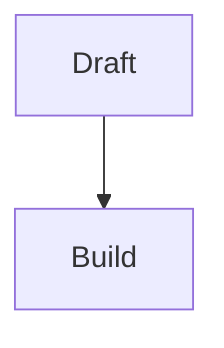

# Content Features

Rich prose renders on all content collections. Frontmatter and collection shapes live in [Content Types](./README.md); aside Type x Tier semantics live in [Admonition & Aside Authoring Schema](./admonition-schema.md); prose theming, font, measure, and token controls live in [Theming](./theming.md).

## The markdown pipeline

Astro wires the pipeline in `astro.config.mjs:53-67`: remark runs `remarkMultilineBlockquote` and `remarkMath`, then rehype runs table quotes, figures, figure credits, directives, admonitions, heading anchors, collapsibles, Mermaid, KaTeX, and sidenotes. The exports are centralized in `src/lib/rehype-plugins.mjs:1-11`.

### Figures

Source: `src/lib/markdown/figures.mjs:20-98`; dimensions: `src/lib/markdown/imageDimensions.mjs:83-101`.

A paragraph containing only an image, for example ``, becomes a `<figure>`. An immediately following italic paragraph becomes the caption; otherwise the image alt text is used. SVG sources are marked as diagrams, raster sources as photos, width and height are stamped from the public asset when possible, and captioned figures get stable `fig-...` anchors.

Gotcha: the image must be the paragraph's only meaningful content. If text or other inline content shares the paragraph, the transform leaves it alone.

### Figure Credits

Source: `src/lib/markdown/figureCredits.mjs:37-109`; lightbox credit display: `src/components/post/Lightbox.astro:70-75`.

An `## Image credits` section followed by a list is treated as the credit source. Each list item should begin with a bold image name, for example `**Diagram name** — source`. The transformer fuzzy-matches those bold names against figure image filenames and stamps `data-credit-ref` on the figure; the lightbox can then show the matched credit.

Gotcha: the credit list must be the first `<ul>` after an `Image credits` heading (case-insensitive). A later list or a different heading is ignored.

### Directives

Source: `src/lib/markdown/directives.mjs:11-79`; float handler: `src/lib/markdown/directives/float.mjs:11-36`; table handler: `src/lib/markdown/directives/table.mjs:13-42`; columns handler: `src/lib/markdown/directives/columns.mjs:5-25`.

Directives are one-line marker paragraphs that apply to the next block:

```md
::: float right width:40% clear:both


```

```md
::: table sortable cols:text,num,date

| Name | Score | Date |
| --- | ---: | --- |
| Ada | 10 | 2026-01-01 |
```

```md
::: columns 3

- One
- Two
- Three
```

`float` applies only to figures and accepts `left` or `right`, optional `width`, and optional `clear:left|right|both`. `table sortable` applies only to tables and can annotate column types as `num`, `text`, `date`, or `auto`. `columns N` applies only to unordered lists; ordered lists are intentionally rejected.

Gotcha: the `:::` marker must be alone in its own paragraph, with a blank line before the target block. Unknown or inapplicable directives emit a warning and leave the marker visible.

### Math

Source: `astro.config.mjs:7-8,55,65`; KaTeX CSS mount: `src/layouts/EntryLayout.astro:2`.

Use `$inline math$` or `$$display math$$`. `remark-math` parses the Markdown and `rehype-katex` renders it at build time, so no math renderer runs in the browser. The config sets `throwOnError: false`, so malformed TeX renders as error markup instead of failing the build.

Example:

```md
$e^{i\pi}+1=0$
```

### Mermaid

Source: `src/lib/markdown/mermaid.mjs:13-38`; runtime mount: `src/components/post/RichProseTools.astro:10-13`.

A fenced code block with `mermaid` language becomes a `<pre class="mermaid" data-mermaid-src="...">` placeholder. `MermaidRuntime` renders it client-side, lazily, and re-renders on theme changes. If JavaScript never runs, the original diagram source remains visible as fallback text.

Example:

````md

````

### Sidenotes / Footnotes

Source: `src/lib/markdown/sidenotes.mjs:4,30-56,58-158`; breakpoint: `src/config/breakpoints.mjs:9`.

Use GitHub-flavored Markdown footnote syntax: write `[^id]` in the paragraph and define `[^id]: body` later. The transformer clones the footnote body into a margin sidenote on wide screens and leaves the footnote section in place for narrow screens. Notes longer than 220 characters get an expand/collapse toggle.

Typed sidenotes start the footnote body with `[!TYPE]`, for example `[^id]: [!CAUTION] The note.` They get an icon and tint in the margin, and a bold label in the mobile footnote. See [Admonition & Aside Authoring Schema](./admonition-schema.md) for the Type x Tier meaning.

### Heading Anchors

Source: `src/lib/markdown/headingAnchors.mjs:3-43`.

Every `h2`, `h3`, and `h4` gets a stable slug if it does not already have one, plus an auto `#` self-link. The generated footnote heading is skipped.

### Collapsible Reference Sections

Source: `src/lib/markdown/collapsibles.mjs:3,45-91`; runtime mount: `src/components/post/RichProseTools.astro:10-13`.

Reference-like `h2` sections matching references, bibliography, image credits, credits, acknowledgements, sources, or further reading fold into `<details>`. Sections with `h3` children fold each subsection; sections without `h3` children fold as a whole.

### Table-Cell Quote Auto-Fix

Source: `src/lib/markdown/tableQuotes.mjs:1-30`.

If smart punctuation turns a leading straight quote in a table cell into a closing curly quote, the table-quote pass flips that leading character back to an opening curly quote. It runs site-wide.

### Pipeline Ordering

Source: `astro.config.mjs:53-67`.

Ordering is part of the contract: figures run before figure credits and directives; admonitions run before heading anchors; heading anchors run before collapsibles; KaTeX runs before sidenotes.

## Reading apparatus

### `readingApparatus` Model

Source: `src/layouts/EntryLayout.astro:22,34,39-64`; blog/page wrapper: `src/layouts/PostLayout.astro:38`; blog route `src/pages/blog/[...slug].astro:12-20`; page route `src/pages/about.astro:10-18`; projects route: `src/pages/projects/[...slug].astro:19`; shared runtimes: `src/components/post/RichProseTools.astro:1-13`.

`EntryLayout` has a single `readingApparatus` boolean. When enabled, it adds the reading-progress bar, mobile table of contents, top/desktop table of contents, and `SectionLens`. It is enabled for blog and page-style content through `PostLayout`, and directly for projects. Garden, reading, and works entries render rich prose without this reading apparatus.

Rich-prose rendering and the reading apparatus are separate: Mermaid, Lightbox, Collapsibles, SortableTables, and KaTeX CSS mount for every `EntryLayout` content entry, while the reading apparatus is currently for blog, pages, and projects.

### Lightbox

Source: `src/components/post/Lightbox.astro:34-40,70-75`.

Figure images and rendered Mermaid SVGs become click-to-zoom items. The lightbox shows the figure caption and, when figure credits matched a source, the credit text.

### Table of Contents

Source: mobile TOC `src/components/post/TableOfContents.astro:14-30`; desktop/top TOC `src/components/post/SectionLens.astro:130-186`.

The mobile table of contents is a `<details>` list of depth-2 headings below the `xl` breakpoint. The desktop lens/top TOC builds links from live `h2`, `h3`, and `h4` ids and nests subheadings under each `h2`.

### Works Details

Source: component `src/components/post/ExpandableDetails.astro:1-48`; route usage `src/pages/works/[...slug].astro:23-29`.

Works entries can render a collapsible Details block from `instrumentation`, `duration`, and `description` frontmatter.

### Sidenote Breakpoint

Source: `src/config/breakpoints.mjs:5-9`.

The custom `sidenote` breakpoint is `1366px`; below that width, margin notes fold back to footnotes.

## Search

### Pagefind

Source: the `postbuild` build hook in `package.json`; index scope `src/layouts/BaseLayout.astro:25`; newsletter exclusion `src/components/newsletter/NewsletterSignup.astro:26`; UI initialization `src/components/search/Search.astro:86-91`.

`npm run build` runs Astro and then `pagefind --site dist`. Pagefind indexes the page `<main data-pagefind-body>` and skips newsletter signup blocks marked `data-pagefind-ignore`. The search component initializes Pagefind UI from `/pagefind/`, enables subresults, and disables result images.

Build and deploy mechanics are owned by the config/ops docs; this page documents only the content-facing search surface.

## Media

### Score Preview

Source: route usage `src/pages/works/[...slug].astro:31-35`; component `src/components/score-preview/ScorePreview.astro:10-57,142-155,212-214,414-421`; pagination math `src/lib/score-preview-pagination.mjs:3-40`.

A `works.score` PDF path renders an embedded two-page-spread reader powered by pdf.js. It includes previous/next controls, zoom controls from `0.6` to `2.0`, keyboard navigation, and a direct download link.

### Works Audio

Source: `src/pages/works/[...slug].astro:17-20`.

A `works.audio` path renders a native `<audio controls>` player above the work prose.

### Collection-Card Audio

Source: `src/scripts/collection-audio.ts:8-24`.

Audio players inside collection cards are mutually exclusive: when one `[data-collection-item] audio` element starts playing, the script pauses the others.
