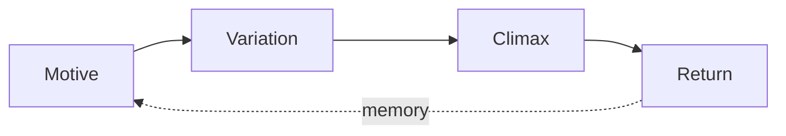

This post is a working tour of every long-form Markdown extension the template adds on top of plain Markdown. Read it rendered to see the features; read its source (`src/content/blog/markdown-extension-showcase.mdx`) to copy the syntax.[^margin-note] The rich extensions run only in the `blog` and `pages` collections.[^scope] Keep one showcase post around while you adapt the template — it makes rendering regressions easy to spot — then replace it once you have settled on what you want.[^long]

## Admonitions

Callouts come in four flavors. Write a blockquote whose first line is `[!TYPE]`:

> [!NOTE]
> `NOTE` is for neutral clarifications and definitions.

> [!TIP]
> `TIP` is for actionable advice and shortcuts.

> [!CAUTION]
> `CAUTION` flags something subtle, or a common mistake.

> [!DANGER]
> `DANGER` marks a serious pitfall — a strong "don't."

For a callout spanning several paragraphs, open a `>>>` fence, put `[!TYPE]` on its own line, and close with a bare `>>>`:

>>>
[!NOTE]
The multi-paragraph form lets you write normal paragraphs without prefixing each line with `>`.

Blank lines, lists, and code all stay intact — everything up to the closing fence belongs to the callout.
>>>

## Math

Inline math uses single dollar signs: a theme that recurs every $n$ bars is roughly $f(t + n) = f(t)$. Display math uses double dollar signs — here, the overtone series above a fundamental $f_0$:

$$
f_k = k \, f_0, \qquad k = 1, 2, 3, \dots
$$

## Diagrams

Fenced `mermaid` blocks render as diagrams, and (like figures) they are click-to-zoom:



## Figures and floats

A paragraph containing only an image becomes a `<figure>`; an italic line just after it becomes the caption, and the image is click-to-zoom. A `::: float` directive wraps the prose around it:

::: float right width:42%


*Symphony No. 5, IV. Adagietto — the opening page.*

The Adagietto opens with muted strings and harp alone — no winds, no brass, no timpani — the texture pared back to its barest essentials. Floating the score beside the prose keeps the example and the discussion in view together, the way a program note sits next to its music. The marking *Sehr langsam* (very slow) sets the tempo, and the strings enter in long, overlapping suspensions that resolve only reluctantly. On a narrow screen the figure drops back to full width and sits above this paragraph instead of beside it, so the layout never crowds the reading column — resize the window to watch it reflow.

## Tables

Prefix a table with `::: table sortable` (and optional column types) to make its headers click-to-sort:

::: table sortable cols:text,num

| Movement | Approx. minutes |
| --- | ---: |
| Trauermarsch | 12 |
| Stürmisch bewegt | 15 |
| Scherzo | 18 |
| Adagietto | 10 |
| Rondo-Finale | 15 |

## Multi-column lists

`::: columns N` lays an unordered list out in N columns — handy for an instrumentation list:

::: columns 2

- 4 Flutes
- 3 Oboes
- 3 Clarinets
- 3 Bassoons
- 6 Horns
- 4 Trumpets
- 3 Trombones
- Tuba
- Timpani & percussion
- Harp
- Strings

## Code

Fenced code blocks are syntax-highlighted. Here is the frontmatter every blog post needs:

```yaml
---
title: "Your post title"
description: "One sentence for listings and search."
date: 2026-02-20
category: "technical"   # technical | slice-of-life | rants
tags: ["example"]
draft: false
---
```

## Sources

### Why this section collapses

A heading named **Sources** (or *References*, *Further reading*, *Image credits*, …) folds into a collapsible section. When it contains `h3` subsections, each one collapses on its own.

### What to replace

Replace this post once you have confirmed the features you want to keep. The syntax for everything above lives in this file's source — copy what you need into your own posts.

## Image credits

- **The Adagietto's opening page** — Gustav Mahler, *Symphony No. 5* (Edition Peters), public-domain scan via [IMSLP](https://imslp.org/wiki/Symphony_No.5%2C_GMW_44_%28Mahler%2C_Gustav%29). Full provenance is in `public/CREDITS.md`.

[^margin-note]: [!CAUTION] A typed sidenote — a footnote whose definition begins with `[!TYPE]` — renders in the margin on wide screens with the callout icon, and folds back into the reading flow on narrow screens.
[^scope]: The rich extensions are scoped to the `blog` and `pages` collections; `garden`, `projects`, and the rest render as plain Markdown. Math is the one exception — it works everywhere.
[^long]: This is a deliberately long sidenote. Once a sidenote's text passes a couple hundred characters, the template gives it a collapse toggle in the margin, so a lengthy aside does not crowd the main column — click the chevron to expand or fold it. Short sidenotes stay open by default. The point is that you can write a substantial digression without forcing every reader through it inline, while still keeping it one glance away.
